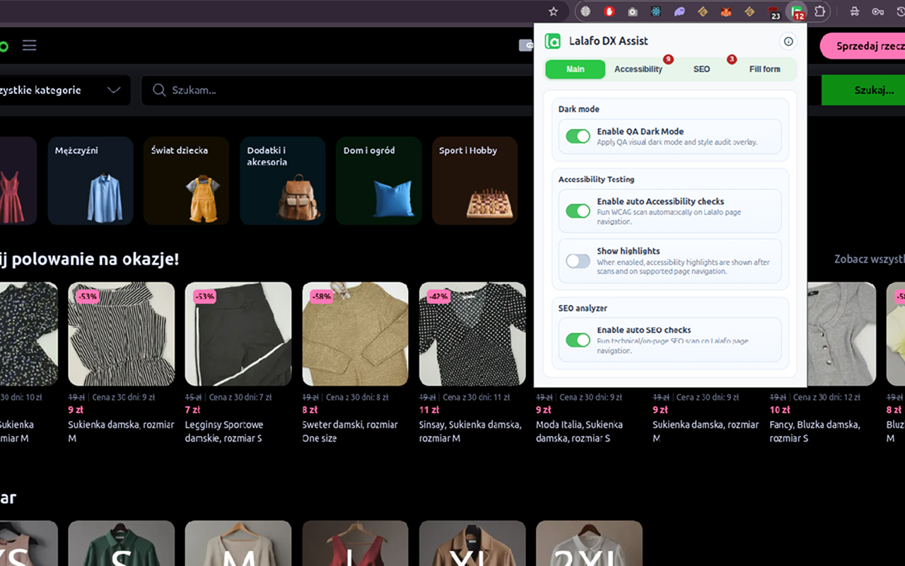
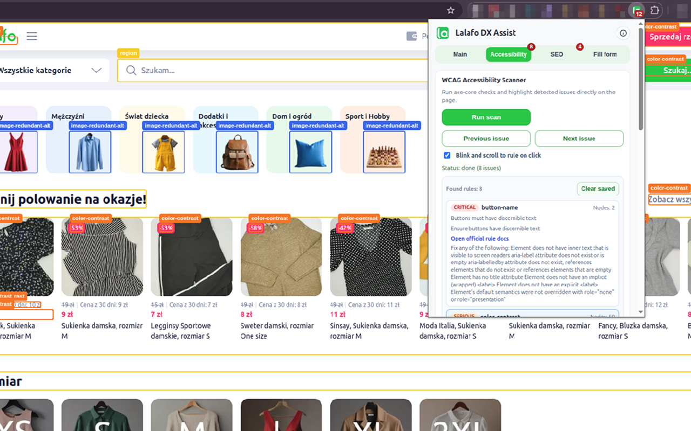

# lalafo-dx-assist

Chrome Extension (Manifest V3, React, TypeScript) for QA and developer workflows on Lalafo regional domains.

## Chrome Web Store

[](https://chromewebstore.google.com/detail/lalafo-dx-assist/fgbnhegcmlmmhcjgnpdcnnejbadebhnf?authuser=0&hl=en-GB) [](https://github.com/poman/lalafo-dx-assist/blob/main/privacy-policy.html) [](https://chromewebstore.google.com/detail/lalafo-dx-assist/fgbnhegcmlmmhcjgnpdcnnejbadebhnf?authuser=0&hl=en-GB)

| Dark mode | Accessibility |
| --- | --- |
|  |  |

## Features

- QA Dark Mode toggle for fast visual checks.
- Accessibility scanner (`axe-core`) with issue list, highlighting, and previous/next navigation.
- SEO analyzer with meta checks and core web vitals (`LCP`, `CLS`, `INP`).
- Form Filler with grouped presets (`Login`, `Register`, `Checkout`, `Custom`) and per-market storage.
- QR quick action to generate a QR code for the active tab and copy URL in one click.
- About modal with repository and author links.

## About

- Repository: `https://github.com/poman/lalafo-dx-assist`
- Developed by: [Roman Kukla](https://linkedin.com/in/romankukla)

## Supported domains

- `lalafo.pl`
- `lalafo.kg`
- `lalafo.az`
- `lalafo.rs`
- `lalafo.gr`

The extension manifest includes both root and wildcard host patterns for each domain in `host_permissions` and `content_scripts.matches`.

## Project scripts

- `pnpm dev` - run Vite in dev mode
- `pnpm build` - build extension to `dist/`
- `pnpm lint` - run ESLint
- `pnpm test` - run unit tests (Vitest)
- `pnpm test:watch` - run tests in watch mode

## Local setup

```bash
pnpm install
pnpm build
```

1. Open Chrome and navigate to `chrome://extensions`.
2. Enable `Developer mode`.
3. Click `Load unpacked` and choose `dist/`.
4. Open any supported Lalafo page.
5. Click the extension icon to use `Main`, `Accessibility`, `SEO`, and `Fill form` tools.
6. Use the `QR` icon in the popup header to generate a QR code for the current page URL.

## Publishing to Chrome Web Store

1. Prepare the extension:
   - Update extension version in `manifest.config.ts` (this generates `manifest.json` in build output)
   - Build the production version: `pnpm build`
   - Create a ZIP file of the `dist` directory:
     ```bash
     # Navigate to the project root directory
     cd /var/www/lalafo-dx-assist

     # Create a ZIP file (requires zip utility)
     mkdir -p release
     zip -r release/lalafo-dx-assist-v0.1.1.zip dist/

     # If zip is not installed, install it first:
     # Ubuntu/Debian: sudo apt-get install zip
     ```

2. Submit to Chrome Web Store:
   - Go to [Chrome Developer Dashboard](https://chrome.google.com/webstore/devconsole)
   - Sign up for a developer account if you haven't already
   - Pay one-time developer registration fee ($5.00)
   - Click "New Item"
   - Upload your ZIP file
   - Fill in required information:
     - Description
     - Screenshots
     - Icon
     - Privacy policy
     - Store listing details
   - Submit for review

3. Wait for review:
   - Review process typically takes few business days
   - Address any feedback if provided by the review team
   - Once approved, your extension will be published to the Chrome Web Store

## Accessibility workflow

1. Open popup and switch to `Accessibility`.
2. Click `Run scan`.
3. Review `Found rules` list.
4. Click an issue to focus corresponding element on page.
5. Use `Previous issue` / `Next issue` to continue audit.
6. Control global highlights from `Main` -> `Accessibility Testing` -> `Show highlights`.

## Troubleshooting

- If a fresh build is not reflected, run:

```bash
pnpm build
```

Then reload the extension in `chrome://extensions`.

- `Accessibility` actions work only on regular web pages (`http/https`) where content scripts can run.
- If scan/highlight controls do not react, refresh target tab and reopen popup.

## Key files

- `manifest.config.ts` - MV3 manifest config, permissions, and content script matches.
- `src/popup/App.tsx` - popup UI (`Main`, `Accessibility`, `SEO`, `Fill form`, `About`, `QR` modal).
- `src/background/main.ts` - auto scans, tab update handling, badge synchronization.
- `src/content/a11yScanner.ts` - axe scan + highlight overlay implementation.
- `src/popup/a11yScanner.ts` - popup bridge for scan/highlight/focus actions.
- `src/popup/formTemplates.ts` - preset model and storage normalization.
- `src/popup/formFiller.ts` - popup-to-content autofill orchestration.
- `src/content/formFiller.ts` - page-side fill logic.
- `src/shared/types/messages.ts` - typed runtime message contracts.
